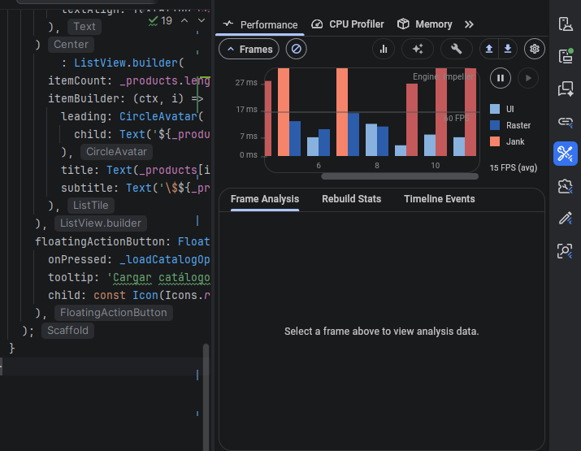
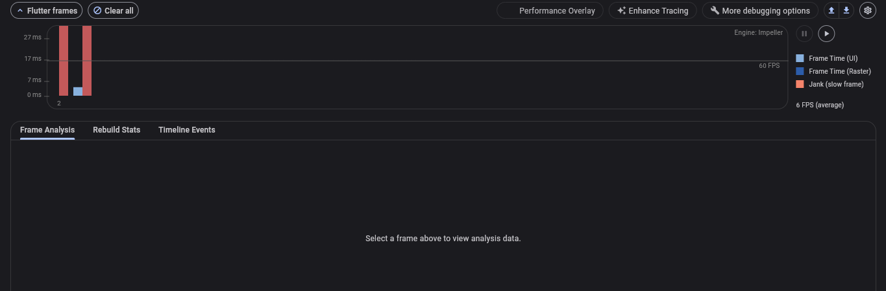
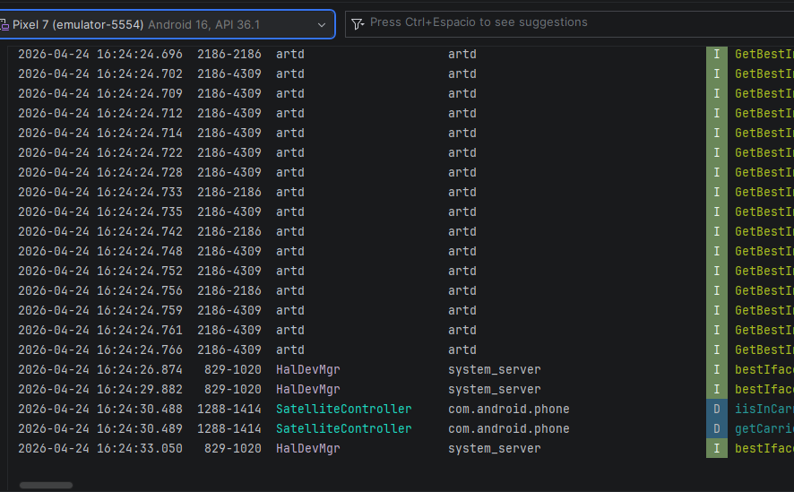

# DevTools, Isolates y Firebase Performance Monitoring

## Autor

**Nombre:** Jhoseth Esneider Rozo Carrillo  
**Código:** 02230131027  
**Programa:** Ingeniería de Sistemas  
**Unidad:** Unidad 8 – Rendimiento, Optimización y Experiencia Fluida  
**Actividad:** Post-Contenido 2  
**Fecha:** 24/04/2026

## Descripción del Proyecto

Este proyecto consiste en el desarrollo de una aplicación Flutter orientada al análisis y optimización del rendimiento de una pantalla de catálogo de productos.

La aplicación simula la carga de un catálogo con 1000 productos en formato JSON. En la primera versión, el procesamiento del JSON se realiza directamente en el hilo principal de la aplicación, lo cual genera bloqueos visibles en la interfaz y produce jank durante la carga.

Después de identificar el problema con Flutter DevTools Timeline, se aplica una optimización usando `compute()`, permitiendo mover el procesamiento pesado del JSON a un isolate secundario. De esta forma, el hilo principal queda libre para mantener la fluidez de la interfaz.

Finalmente, se integra Firebase Performance Monitoring para registrar una traza personalizada llamada `catalog_load`, con una métrica custom llamada `product_count`, permitiendo medir el tiempo real de carga del catálogo y validar el comportamiento de la aplicación con Logcat.

## Objetivo del Proyecto

El objetivo principal es identificar problemas de jank en una aplicación Flutter, analizar el cuello de botella con Flutter DevTools, optimizar el procesamiento costoso usando isolates y registrar métricas de rendimiento mediante Firebase Performance Monitoring.

La aplicación permite:

- Generar un catálogo de 1000 productos.
- Cargar productos desde un JSON simulado.
- Ejecutar una versión bloqueante para evidenciar jank.
- Analizar frames rojos o amarillos en Flutter DevTools Timeline.
- Identificar el costo de `jsonDecode` en el hilo principal.
- Migrar el procesamiento pesado a un isolate secundario con `compute()`.
- Mantener la animación de carga fluida durante el procesamiento.
- Registrar una traza personalizada con Firebase Performance.
- Agregar una métrica custom llamada `product_count`.
- Verificar en Logcat que la traza `catalog_load` se registra correctamente.
- Comparar el rendimiento antes y después de la optimización.

## Nombre del Repositorio

El repositorio público de GitHub debe tener el siguiente nombre:

**rozo-post2-u8**

## Prerrequisitos

Para ejecutar correctamente este proyecto se debe contar con el siguiente entorno:

- Flutter SDK 3.16 o superior.
- Dart 3.2 o superior.
- Visual Studio Code o Android Studio con el plugin de Flutter instalado.
- Proyecto Firebase activo.
- FlutterFire CLI configurada.
- Dependencias de Firebase instaladas en el proyecto.
- Dispositivo físico o emulador compatible.
- Flutter DevTools accesible desde el entorno de desarrollo.
- Conocimiento básico de Futures.
- Conocimiento básico de async y await.
- Conocimiento básico de widgets Stateful.
- Conocimiento básico de análisis de rendimiento en Flutter.

Se recomienda ejecutar la aplicación en modo profile para obtener mediciones más reales durante el análisis con Flutter DevTools.

## Tecnologías Utilizadas

- Flutter
- Dart
- Flutter DevTools
- DevTools Timeline
- Isolates
- compute
- Firebase Core
- Firebase Performance Monitoring
- FlutterFire CLI
- Logcat
- Android Studio
- Visual Studio Code

## Arquitectura Implementada

El proyecto utiliza una estructura sencilla y clara, organizada por responsabilidades dentro de una aplicación Flutter.

La arquitectura general de funcionamiento es la siguiente:

- La pantalla de catálogo permite iniciar la carga de productos.
- El generador crea un JSON simulado con 1000 productos.
- El modelo representa cada producto del catálogo.
- La versión inicial procesa el JSON en el hilo principal.
- Flutter DevTools permite detectar jank durante la carga.
- La versión optimizada mueve el procesamiento a un isolate secundario.
- Firebase Performance registra una traza personalizada de la carga.
- Logcat permite verificar que la traza fue registrada correctamente.

Esta arquitectura permite comparar de forma directa el comportamiento de una versión bloqueante contra una versión optimizada.

## Estructura del Proyecto

La estructura principal del proyecto es la siguiente:

- lib
  - main.dart
  - firebase_options.dart
  - models
    - product_model.dart
  - screens
    - catalog_screen.dart
  - utils
    - catalog_generator.dart
- screenshots
  - devtools_timeline_bloqueante.png
  - devtools_timeline_compute.png
  - logcat_firebase_performance_catalog_load.png
- pubspec.yaml
- README.md

La carpeta `screenshots` contiene las capturas requeridas por la actividad.

## Capas del Proyecto

### models

Esta capa contiene el modelo de datos utilizado para representar los productos del catálogo.

- **Product:** representa un producto con identificador, nombre y precio.

### screens

Esta capa contiene la pantalla principal del proyecto.

- **CatalogScreen:** pantalla encargada de mostrar el catálogo, iniciar la carga de productos, evidenciar la versión bloqueante y validar la versión optimizada.

### utils

Esta capa contiene utilidades auxiliares para la generación de datos de prueba.

- **catalog_generator:** genera el JSON simulado con 1000 productos para realizar las pruebas de rendimiento.

### screenshots

Esta carpeta contiene las evidencias visuales solicitadas en la actividad.

- Captura de DevTools Timeline con frames rojos o amarillos en la versión bloqueante.
- Captura de DevTools Timeline con frames verdes en la versión optimizada con `compute()`.
- Captura de Logcat con la traza de Firebase Performance registrada correctamente.

## Funcionamiento General de la Aplicación

La aplicación muestra una pantalla de catálogo de productos. Al presionar el botón flotante, se inicia la carga de un JSON simulado con 1000 productos.

En la versión inicial, el JSON se genera, se decodifica y se transforma en objetos directamente en el hilo principal. Esto provoca que la interfaz se congele brevemente durante la operación, especialmente cuando se presiona el botón varias veces o cuando el dispositivo tiene recursos limitados.

Este bloqueo se observa visualmente porque el indicador de carga puede detenerse por un momento. Además, Flutter DevTools permite confirmar el problema mostrando frames con duración superior a 16 milisegundos.

En la versión optimizada, la decodificación y transformación del JSON se ejecuta en un isolate secundario usando `compute()`. Con esta mejora, la interfaz permanece fluida mientras se procesa el catálogo.

## Implementación Inicial Bloqueante

La primera versión del proyecto fue creada intencionalmente con un cuello de botella en el hilo principal.

En esta versión, el procesamiento del catálogo ocurre directamente en el main thread. Esto significa que la generación del JSON, la decodificación y el mapeo de productos compiten con el renderizado de la interfaz.

Este comportamiento permite evidenciar:

- Congelamiento breve de la interfaz.
- Jank visible durante la carga.
- Frames rojos o amarillos en DevTools Timeline.
- Duraciones superiores a 16 milisegundos por frame.
- Bloqueo temporal del indicador de carga.
- Mayor carga en el hilo principal.
- Dificultad para mantener una experiencia fluida.

Esta versión sirve como línea base para comparar las mejoras después de migrar el procesamiento a un isolate.

## Checkpoint 1: Aplicación Ejecutando con Jank Visible

En este checkpoint se verifica que la aplicación ejecute en modo profile y que el problema de rendimiento sea visible.

Condiciones verificadas:

- La aplicación ejecuta correctamente en modo profile.
- La pantalla de catálogo se muestra sin errores.
- Al presionar el botón flotante varias veces se inicia la carga del catálogo.
- El catálogo contiene 1000 productos.
- El indicador de carga se congela brevemente durante el procesamiento.
- Flutter DevTools Timeline muestra frames rojos o amarillos.
- Algunos frames superan el objetivo de 16 milisegundos.
- El comportamiento confirma la existencia de jank en la versión bloqueante.

Este checkpoint permite establecer una línea base de rendimiento antes de aplicar la optimización.

## Perfilado Inicial con Flutter DevTools Timeline

Para analizar el problema de rendimiento se utilizó Flutter DevTools en modo profile.

El proceso realizado fue el siguiente:

1. Ejecutar la aplicación en modo profile.
2. Abrir Flutter DevTools.
3. Ir a la pestaña Performance.
4. Entrar a Timeline.
5. Iniciar una grabación.
6. Presionar el botón flotante de la aplicación.
7. Detener la grabación después de la carga.
8. Revisar los frames generados durante el procesamiento.
9. Identificar frames rojos o amarillos.
10. Analizar el stack trace del frame problemático.
11. Confirmar que el procesamiento del JSON estaba afectando el hilo principal.

Durante esta medición se identificó que la operación de decodificación del JSON era una de las principales responsables del jank.

## Trazas Manuales en Timeline

Además del análisis automático de DevTools, se agregaron trazas manuales para identificar secciones específicas del proceso de carga.

Las trazas usadas permitieron separar las etapas principales:

- Generación del JSON.
- Decodificación del JSON.
- Conversión de datos a productos.

Estas trazas facilitaron la lectura del Timeline y permitieron ubicar con mayor claridad qué sección consumía más tiempo durante la versión bloqueante.

## Evidencia de DevTools Timeline Antes de compute

La siguiente captura muestra el comportamiento de la aplicación antes de aplicar la optimización con `compute()`.

En esta evidencia se observan frames rojos o amarillos durante la carga del catálogo. Esto indica que el hilo principal tuvo trabajo pesado y no logró mantener todos los frames por debajo de 16 milisegundos.

## Problema Detectado

El problema principal detectado fue el procesamiento pesado del JSON en el hilo principal.

Aunque la aplicación funciona correctamente, la experiencia de usuario se ve afectada porque el hilo encargado de renderizar la interfaz también debe procesar el catálogo. Esto genera bloqueos temporales y pérdida de fluidez.

Los efectos negativos observados fueron:

- Jank visible al cargar el catálogo.
- Congelamiento del indicador de carga.
- Frames con duración superior a 16 milisegundos.
- Mayor carga en el main thread.
- Experiencia menos fluida.
- Riesgo de bajo rendimiento en dispositivos con menos recursos.

Este problema justifica la migración del procesamiento a un isolate secundario.

## Optimización con Isolate y compute

Para solucionar el problema se migró la decodificación y transformación del catálogo a un isolate secundario usando `compute()`.

Con esta optimización, el procesamiento pesado ya no se realiza en el hilo principal. El isolate secundario se encarga de convertir el JSON en una lista de productos, mientras el hilo principal permanece disponible para renderizar la interfaz.

Como resultado, el indicador de carga mantiene su animación de forma continua y el Timeline muestra frames más estables.

Esta mejora permite:

- Liberar el hilo principal.
- Evitar bloqueos visibles de la interfaz.
- Reducir el jank durante la carga.
- Mantener frames por debajo del objetivo de 16 milisegundos.
- Mejorar la experiencia visual del usuario.
- Separar el procesamiento pesado del renderizado de la UI.

## Checkpoint 2: Aplicación Optimizada con compute

En este checkpoint se verifica que la optimización funcione correctamente.

Condiciones verificadas:

- La aplicación ejecuta nuevamente en modo profile.
- El catálogo sigue cargando 1000 productos.
- El botón flotante inicia la carga correctamente.
- El procesamiento se realiza en un isolate secundario.
- El indicador de carga gira de forma continua.
- La interfaz no se congela durante la carga.
- Flutter DevTools Timeline muestra frames verdes.
- Los frames durante la carga se mantienen por debajo de 16 milisegundos.
- La comparación antes y después evidencia la eliminación del jank.

Este checkpoint demuestra que la migración a `compute()` mejora la fluidez de la aplicación.

## Evidencia de DevTools Timeline Después de compute

La siguiente captura muestra el comportamiento de la aplicación después de aplicar la optimización con `compute()`.

Después de la optimización, los frames se mantienen estables y la interfaz responde de forma fluida durante la carga del catálogo.

## Comparación de Rendimiento

| Métrica                 | Antes de compute           | Después de compute     |
| ----------------------- | -------------------------- | ---------------------- |
| Lugar del procesamiento | Hilo principal             | Isolate secundario     |
| Experiencia visual      | Congelamiento breve        | Animación continua     |
| Frames en Timeline      | Rojos o amarillos          | Verdes                 |
| Duración de frames      | Algunos mayores a 16 ms    | Por debajo de 16 ms    |
| Trabajo del main thread | Alto durante la carga      | Reducido               |
| Jank visible            | Sí                         | No                     |
| Fluidez de la interfaz  | Afectada                   | Mejorada               |
| Resultado general       | Funcional, pero bloqueante | Funcional y optimizado |

La mejora principal se obtiene al sacar del hilo principal la operación costosa de procesamiento del JSON.

## Integración con Firebase Performance Monitoring

Además de la medición local con DevTools, el proyecto integra Firebase Performance Monitoring para registrar métricas de rendimiento desde la aplicación.

Se creó una traza personalizada llamada:

**catalog_load**

Esta traza mide el tiempo total de carga del catálogo optimizado.

También se agregó una métrica personalizada llamada:

**product_count**

Esta métrica registra la cantidad de productos procesados durante la carga. En este caso, el valor esperado es 1000.

Firebase Performance permite observar el comportamiento real de la operación y registrar información útil para el análisis de rendimiento.

## Configuración de Firebase

Para integrar Firebase Performance se configuró un proyecto Firebase activo y se vinculó la aplicación Flutter mediante FlutterFire CLI.

La configuración incluye:

- Inicialización de Firebase al iniciar la aplicación.
- Archivo de configuración generado por FlutterFire.
- Dependencia de Firebase Core.
- Dependencia de Firebase Performance.
- Registro de una traza personalizada.
- Registro de una métrica custom.
- Validación de logs desde Logcat.

En Firebase Console, las trazas personalizadas pueden tardar varias horas en aparecer. Por esta razón, para la verificación inmediata se utilizó el logging de Firebase Performance en Logcat.

## Checkpoint 3: Firebase Performance Registrando la Traza

En este checkpoint se verifica que Firebase Performance esté integrado correctamente y que la traza personalizada se registre sin errores.

Condiciones verificadas:

- La aplicación compila con Firebase Performance integrado.
- Firebase se inicializa correctamente.
- La carga del catálogo ejecuta la traza `catalog_load`.
- La traza registra la duración de la operación.
- La métrica `product_count` se registra con el total de productos.
- Logcat muestra el registro de la traza personalizada.
- No aparecen errores de inicialización de Firebase.
- La evidencia muestra el mensaje relacionado con el registro de la traza.

## Evidencia de Logcat con Firebase Performance

La siguiente captura muestra el registro de Firebase Performance en Logcat.

En esta evidencia se confirma que la traza `catalog_load` fue registrada correctamente y que la aplicación reporta la métrica asociada a la carga del catálogo.

## Capturas del Proyecto

Las evidencias solicitadas se encuentran en la carpeta `/screenshots/`.

## DevTools Timeline con Frames Rojos o Amarillos

## DevTools Timeline con Frames Verdes

## Logcat con Traza Firebase Performance

## Análisis de las Mejoras Obtenidas

Antes de la optimización, la carga del catálogo procesaba el JSON directamente en el hilo principal. Esto provocaba jank visible y frames superiores a 16 milisegundos durante la operación.

Después de migrar el procesamiento a un isolate secundario con `compute()`, la interfaz mantuvo una respuesta fluida durante la carga. El indicador de progreso dejó de congelarse y DevTools Timeline mostró frames verdes durante el proceso.

Las mejoras observadas fueron:

- Eliminación del jank visible durante la carga.
- Reducción del trabajo en el hilo principal.
- Mayor estabilidad en los frames.
- Mejora en la fluidez visual.
- Animación de carga continua.
- Separación adecuada entre procesamiento pesado y renderizado de UI.
- Registro de métricas personalizadas con Firebase Performance.
- Validación de la traza `catalog_load` desde Logcat.

Esta optimización mejora directamente la experiencia del usuario, especialmente en operaciones donde se procesan datos pesados o grandes cantidades de información.

## Instrucciones para Ejecutar el Proyecto

Para ejecutar el proyecto se deben seguir estos pasos:

1. Clonar el repositorio desde GitHub.
2. Abrir el proyecto en Android Studio o Visual Studio Code.
3. Ejecutar la instalación de dependencias de Flutter.
4. Verificar que Firebase esté configurado correctamente.
5. Ejecutar la aplicación en un emulador o dispositivo físico.
6. Para análisis de rendimiento, ejecutar la aplicación en modo profile.
7. Abrir Flutter DevTools.
8. Presionar el botón flotante en la pantalla de catálogo.
9. Revisar los resultados en DevTools Timeline.
10. Para Firebase Performance, revisar Logcat con el logging activado.

## Instrucciones para Realizar el Profiling

Para repetir las mediciones de rendimiento se deben seguir estos pasos:

1. Ejecutar la aplicación en modo profile.
2. Abrir Flutter DevTools.
3. Entrar a la pestaña Performance.
4. Seleccionar Timeline.
5. Iniciar una grabación.
6. Presionar el botón flotante de la aplicación.
7. Detener la grabación.
8. Identificar los frames generados durante la carga.
9. Revisar si existen frames rojos, amarillos o verdes.
10. Comparar la versión bloqueante contra la versión optimizada con `compute()`.
11. Revisar la duración de los frames.
12. Confirmar que la versión optimizada mantiene la UI fluida.

## Instrucciones para Verificar Firebase Performance

Para validar Firebase Performance se deben seguir estos pasos:

1. Confirmar que el proyecto Firebase esté configurado.
2. Confirmar que la aplicación tenga Firebase inicializado.
3. Ejecutar la aplicación en modo debug.
4. Activar el logging de Firebase Performance.
5. Presionar el botón flotante para cargar el catálogo.
6. Abrir Logcat en Android Studio.
7. Filtrar por Firebase Performance.
8. Confirmar el registro de la traza `catalog_load`.
9. Confirmar que la métrica `product_count` esté asociada a la traza.
10. Guardar la captura correspondiente en la carpeta `/screenshots`.

## Validación de la Rúbrica

### Implementación

El proyecto cumple con los siguientes puntos:

- Incluye una versión bloqueante para establecer una línea base.
- Implementa una versión optimizada usando `compute()`.
- Migra el procesamiento pesado a un isolate secundario.
- Integra Firebase Performance Monitoring.
- Registra una traza personalizada llamada `catalog_load`.
- Registra una métrica custom llamada `product_count`.
- Agrega trazas manuales para facilitar el análisis en Timeline.
- Mantiene una estructura Flutter estándar.
- Usa nombres descriptivos en camelCase.

### Funcionalidad

El proyecto cumple con los siguientes puntos:

- La aplicación ejecuta sin errores.
- La versión bloqueante genera jank visible.
- Flutter DevTools evidencia frames rojos o amarillos antes de la optimización.
- La versión optimizada elimina el jank visible.
- Flutter DevTools evidencia frames verdes después de usar `compute()`.
- Firebase Performance registra la traza personalizada.
- Logcat muestra evidencia del registro de `catalog_load`.
- La métrica `product_count` se registra correctamente.

### Documentación

Este README cumple con los siguientes puntos:

- Describe el objetivo del proyecto.
- Explica el escenario inicial bloqueante.
- Explica el análisis con Flutter DevTools Timeline.
- Explica la optimización con isolate y `compute()`.
- Describe la integración de Firebase Performance Monitoring.
- Incluye capturas antes y después.
- Incluye captura de Logcat.
- Presenta análisis comparativo de la mejora.
- Documenta la estructura del proyecto.
- Incluye instrucciones de ejecución y profiling.
- Incluye commits descriptivos solicitados.

### Estilo y Convenciones

El proyecto cumple con los siguientes puntos:

- Código escrito en Dart.
- Nombres descriptivos en camelCase.
- Estructura de carpetas Flutter estándar.
- Separación entre modelos, pantallas y utilidades.
- Mínimo tres commits descriptivos.
- Commits escritos con convención clara.
- README organizado y alineado con la actividad.

---

## Capturas de pantalla

as siguientes evidencias se encuentran en la carpeta `/evidencias/`:

## Devtools after

## Devtools before

## Firebase logcat

